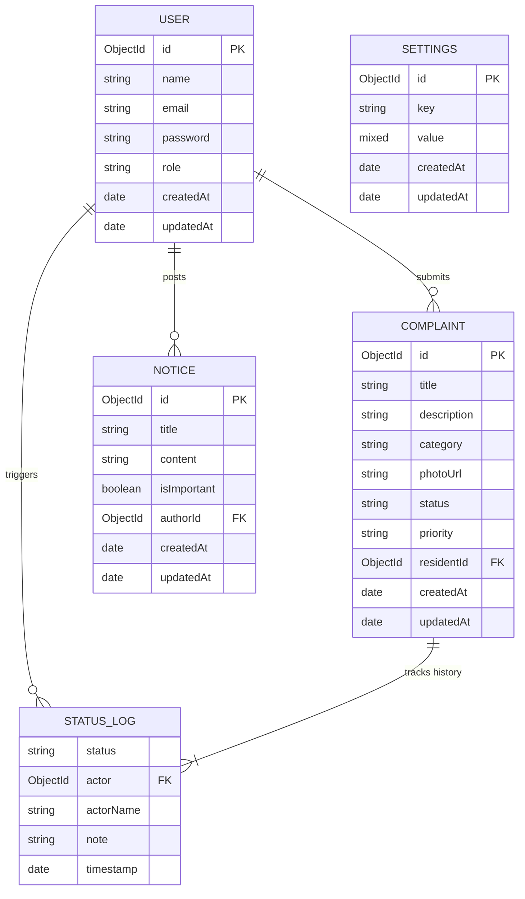

# Society Maintenance Tracker

**Live Hosted Application URL**: [https://society-maintenance-tracker-3xp8.onrender.com](https://society-maintenance-tracker-3xp8.onrender.com)

A premium, modern web application built on the **MERN (MongoDB, Express.js, React, Node.js)** stack. It offers residents a sleek interface to raise and monitor support tickets with photo uploads, while providing administrators a robust dashboard with overdue ticket auto-surfacing, priority controls, notice board managers, and automated status change email notifications.

---

## Architecture & Tech Stack

- **Backend**: Node.js & Express.js server supplying a RESTful API.
- **Frontend**: Vite + React single-page application utilizing premium Vanilla CSS styling, responsive CSS custom variables, and clean glassmorphism styling.
- **Database**: MongoDB (via Mongoose ODM) with schemas for Users, Complaints, Notice Board messages, and global Configurations.
- **Authentication**: JWT (JSON Web Token) authorization stored locally on client, with role-based access gates (`resident` / `admin`).
- **File Storage**: Local uploads of complaint photos handled via Multer middleware.
- **Notifications**: Nodemailer email alerts sent when tickets undergo status shifts or when important notices are pinned.

---

## Directory Structure

```text
├── backend/
│   ├── config/             # DB configuration
│   ├── middleware/         # Auth verification and file filter helpers
│   ├── models/             # Mongoose database schemas
│   ├── routes/             # Express API endpoints
│   ├── uploads/            # Local directory for user attached images
│   ├── utils/              # Email transporter module
│   ├── .env                # Server local env vars (ignored in git)
│   ├── package.json        # Backend dependencies
│   ├── server.js           # Express main server entry
│   └── test-api.js         # API integration verification script
│
├── frontend/
│   ├── src/
│   │   ├── components/     # Reusable layout guards (ProtectedRoute)
│   │   ├── context/        # Session AuthContext state provider
│   │   ├── pages/          # Login, Register, Dashboards view screens
│   │   ├── utils/          # API fetch utility client
│   │   ├── App.jsx         # App router routing paths
│   │   ├── index.css       # Core styling, animations, themes stylesheet
│   │   └── main.jsx        # SPA mount point
│   ├── package.json        # Frontend dependencies
│   └── vite.config.js      # Vite compilation settings
│
├── .gitignore              # Project Git ignore list
├── .env.example            # Environment variables template
├── README.md               # User manual and setup guidelines (This file)
└── system_design.md        # 800-word design methodology write-up
```

---

## Setup & Running Guide

### Prerequisites
- Node.js (v18.0.0 or higher recommended)
- MongoDB installed locally (running on `mongodb://127.0.0.1:27017`) or a remote MongoDB Atlas URI.

### Step 1: Configure Environment Variables

1. Rename the `.env.example` at the root to `.env` or create a `.env` in the `backend/` folder:
   ```bash
   PORT=5000
   MONGO_URI=mongodb://127.0.0.1:27017/society_maintenance_tracker
   JWT_SECRET=developer_security_signing_key_secret
   JWT_EXPIRES_IN=30d
   ```
2. **Email Delivery Configuration (Optional)**:
   - **Method A (Resend API - Preferred for Production)**: Add `RESEND_API_KEY=re_your_api_key_here` to bypass cloud firewall SMTP port blocks (e.g., Render Free Tier).
   - **Method B (SMTP Settings)**: Fill in `EMAIL_HOST`, `EMAIL_PORT`, `EMAIL_USER`, and `EMAIL_PASS` (e.g., Gmail App Password).
   - If left blank, the app runs in **Mock Mode**, printing email bodies directly to the terminal logs.

### Step 2: Run Locally (Development Mode)

1. **Start Backend**: Navigate to the `backend/` directory, install packages, and boot:
   ```bash
   cd backend
   npm install
   npm run dev
   ```
2. **Start Frontend**: Open a new terminal, navigate to `frontend/`, install packages, and boot:
   ```bash
   cd frontend
   npm install
   npm run dev
   ```
3. Open [http://localhost:5173](http://localhost:5173) in your browser.

### Step 3: Run the Database Clean Utility
To wipe all notice and complaint documents and clear any uploaded static image files, run:
```bash
cd backend
node clear-data.js
```

### Step 4: Run Unified Build (Production Mode)
The project is configured as a monolithic monorepo. You can compile and test the production-ready build of both frontend and backend using the root-level unified script:
```bash
# In the repository root directory:
npm run build
npm start
```

### Step 5: Verify Backend API (Integration Test)
With the backend server running locally, you can verify all API endpoints automatically by running:
```bash
cd backend
node test-api.js
```

---

## Database Schemas

We use MongoDB as our database, modeled with Mongoose. Below is the Entity-Relationship Diagram (ERD) and detailed field descriptions for our collections:

### Entity-Relationship Diagram (ERD)



### Detailed Schema Fields

#### 1. User Collection
- `name` (String, required)
- `email` (String, required, unique, validated)
- `password` (String, required, hashed with Bcrypt)
- `role` (String, enum: `['resident', 'admin']`, default: `'resident'`)

#### 2. Complaint Collection
- `title` (String, required, max 100 chars)
- `description` (String, required)
- `category` (String, required, enum: Plumbing, Electrical, Security, Cleanliness, Common Area, Others)
- `photoUrl` (String, relative path from static server)
- `status` (String, enum: Open, In Progress, Resolved)
- `priority` (String, enum: Low, Medium, High)
- `residentId` (ObjectId, ref User)
- `statusHistory` (Array of status change logs):
  - `status` (String)
  - `actor` (ObjectId, ref User)
  - `actorName` (String)
  - `note` (String)
  - `timestamp` (Date)

#### 3. Notice Collection
- `title` (String, required)
- `content` (String, required)
- `isImportant` (Boolean, default: false) - pins announcement and sends emails
- `authorId` (ObjectId, ref User)

#### 4. Settings Collection
- `key` (String, unique) - e.g., `'overdue_threshold_days'`
- `value` (Mixed) - e.g., `3`
---

## API Endpoints Documentation

### Authentication (`/api/auth`)
- `POST /register`: Register a user. Body: `{ name, email, password, role }`.
- `POST /login`: Log in. Body: `{ email, password }`. Returns JWT token and User info.
- `GET /me`: Returns current user details (JWT validation required).

### Settings (`/api/settings`)
- `GET /`: Get settings. Returns overdue threshold configuration.
- `PUT /`: Update settings. Body: `{ overdueThresholdDays }`. (Admin only).

### Notice Board (`/api/notices`)
- `GET /`: Fetch all notice posts. Important (pinned) notices appear first.
- `POST /`: Create notice. Body: `{ title, content, isImportant }`. (Admin only).
- `DELETE /:id`: Delete notice. (Admin only).

### Complaints Tracker (`/api/complaints`)
- `POST /`: Submit new complaint (Supports Multipart FormData for uploads). (Resident only).
- `GET /`: Retrieve all complaints. Filters: `?category=...&status=...&date=...&overdue=true`. (Admin only).
- `GET /my`: Get logged-in resident's own complaints.
- `PUT /:id/status`: Edit ticket status. Body: `{ status, note }`. (Admin only).
- `PUT /:id/priority`: Edit priority. Body: `{ priority }`. (Admin only).

### Admin Dashboard Stats (`/api/dashboard/stats`)
- `GET /stats`: Retrieve counts by status, by category, total, and overdue count. (Admin only).
