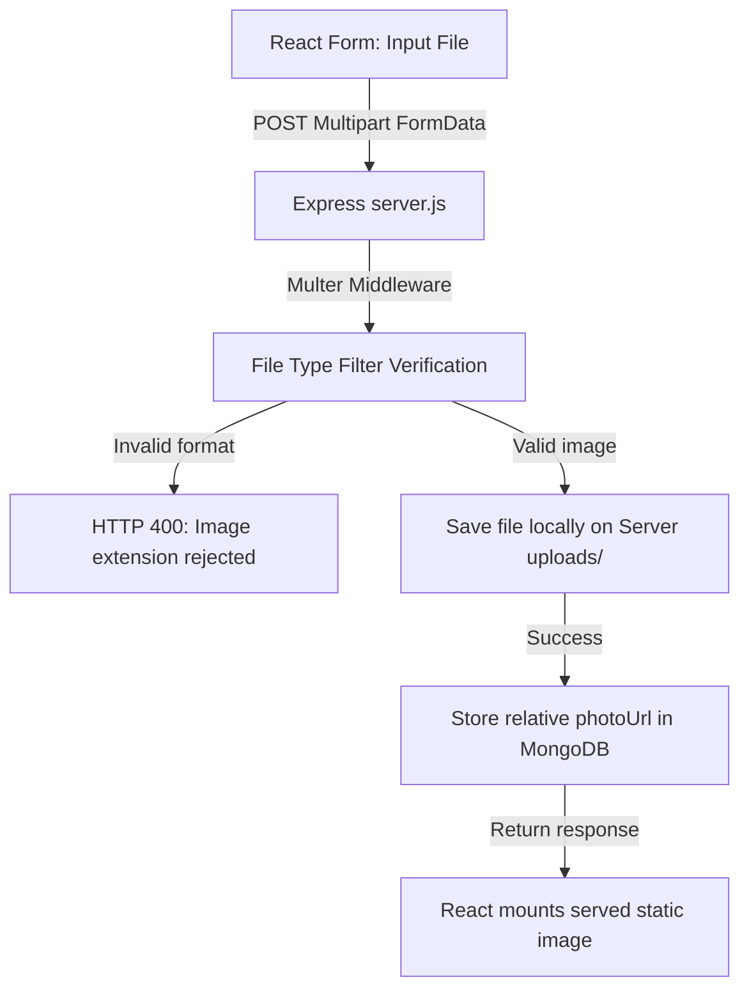
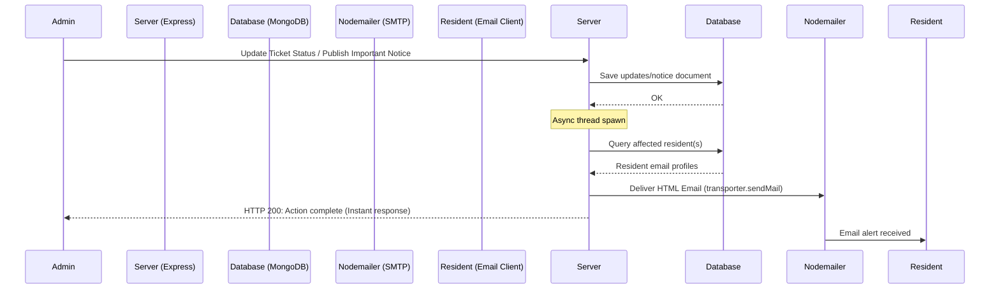

# System Design: Society Maintenance Tracker

This document details the system architecture and implementation design for the **Society Maintenance Tracker** platform, focusing on the complaint history model, overdue detection, photo uploads handling, and the notification flow.

---

## 1. Complaint Status Lifecycle & History Model

To ensure transparency and tracking for both residents and administration, the ticket lifecycle is modeled with a permanent, read-only audit log. Rather than maintaining only a single state field, each `Complaint` document contains an embedded `statusHistory` array of status logs:

```javascript
statusHistory: [{
  status: { type: String, enum: ['Open', 'In Progress', 'Resolved'] },
  actor: { type: Schema.Types.ObjectId, ref: 'User' },
  actorName: { type: String },
  note: { type: String },
  timestamp: { type: Date, default: Date.now }
}]
```

### Design Advantages
- **Traceability**: An automatic pre-save hook handles the insertion of the initial `Open` log during complaint generation, recording the reporter's ID as the actor. Subsequent transitions to `In Progress` or `Resolved` require administrators to log notes explaining what action has been taken.
- **Performance**: Embedding the history log array directly inside the parent `Complaint` document minimizes the number of joins, allowing the frontend to load both ticket details and the complete timeline via a single database query.

---

## 2. Dynamic Overdue Detection

Rather than relying on static cron jobs that update state periodically, overdue tickets are computed **dynamically** in real-time during query executions. This ensures that tickets are flagged overdue immediately when configurations change, without introducing database synchronization lags.

### Algorithmic Execution
1. **Configurable Threshold**: Admins can customize the threshold (default: `3` days) via the settings endpoint, which is saved in a key-value `Settings` collection.
2. **Query Filtering**: When retrieving complaints, the database fetches the configuration and calculates the cutoff date:
   $$\text{Cutoff Date} = \text{Date.now()} - (\text{Threshold Days} \times 24 \times 3600 \times 1000)$$
3. **Database Selection**: A ticket is flagged as overdue if:
   - Its status is **not** `'Resolved'`.
   - Its `createdAt` timestamp is **before** the cutoff date.
4. **Sorting Logic**: Overdue complaints are dynamically flagged with an `isOverdue` boolean attribute in the Express router and sorted so they bubble up to the absolute top of the admin workspace view.

---

## 3. Photo Handling & Local Storage Architecture

Attached photo proofs provide context to maintenance workers. The platform handles image files via a robust streaming multi-part parser:



### Implementation Safeguards
- **File Integrity**: The system filters files by MIME types and file extensions using regular expressions, restricting files to standard image types (`jpeg`, `png`, `webp`, `gif`). It also enforces a `5MB` upload file size limit.
- **Portability**: Uploaded files are renamed using a combination of the current timestamp and a randomized suffix to prevent filename collisions. They are stored in an `uploads/` directory on the server and served statically via Express, making the system self-contained and highly portable for offline evaluation.

---

## 4. Notice Board & Email Notification Flow

To keep residents updated, we implemented an asynchronous notification flow triggered by database updates. When an admin posts an announcement marked as important, or alters the status of an existing ticket:



### Execution Strategy
- **Non-blocking Operations**: The email delivery process runs asynchronously (using JavaScript promise chains) after the database write succeeds. This ensures that slow SMTP handshake delays do not block the admin API response, maintaining a fast user experience.
- **Fail-safe Logging**: If SMTP settings are unconfigured or fail during local testing, the system logs a mock warning and prints the entire message body to the console. This guarantees that evaluation runs smoothly without crashes.
